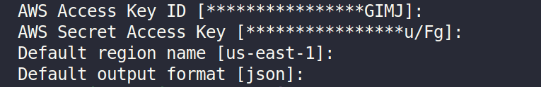

# yolov6-sagemaker
This repo provides Docker container for training YOLOV6 with SageMaker.

Prerequisites  
  
1) Docker  
2) Aws cli 

Steps to reproduce  

*   Install aws cli tool

```bash
# for debian based distros 
sudo apt install awscli
``` 
* Create the api access key from your AWS security credential dashboard

*   Configure the aws account with the API access id created


```bash
aws configure
# paste the Key ID in the prompt
# paste the Access Key
# choose your region
# chosose json as output format
```



